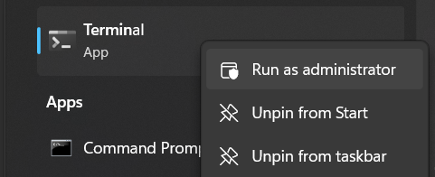

Installing and launching the server locally
===========================================

The following instructions will install and launch the Dashboards server and all related services.
Steps 1-4 and 6 only need to be run once, Step 5 only if the source code has changed, and Step 7
every time the server is launched.

1. Install WSL2 and Ubuntu (for Windows machines)
-------------------------------------------------

Start a Windows terminal as Administrator by searching for "Terminal" in the command line
and right-clicking to expose the menu:

If Terminal is not installed, it can be downloaded from the Microsoft Store at:
https://www.microsoft.com/store/productid/9N0DX20HK701.

In the new terminal, enter ``wsl --install`` and follow the prompts.  For detailed instructions,
see https://learn.microsoft.com/en-us/windows/wsl/install.

2. Install Docker Desktop
-------------------------

Follow the instructions at: https://docs.docker.com/desktop/install/windows-install/.
Be sure that the WSL2 backend is enabled.

Note: read `Do I need to pay to use Docker Desktop? <https://docs.docker.com/desktop/faqs/general/#do-i-need-to-pay-to-use-docker-desktop>`_.

3. Clone the repository
-----------------------

If you do not already have a Personal Access Token (PAT) for https://gitlab.developers.cam.ac.uk,
create one as follows:

1. Log in to https://gitlab.developers.cam.ac.uk. University of Cambridge account
holders should sign in using Raven.  External collaborators must obtain a username and password
from University Information Services; a University of Cambridge team member can do this
by raising an GitLab issue (see `this FAQ page <https://gitlab.developers.cam.ac.uk/uis/devops/devhub/docs/-/wikis/FAQs#how-can-i-invite-external-collaborators>`_.)

.. image:: _static/gitlab_login.png
    :width: 300

2. Select "**Preferences**" in the drop-down menu, accessed by clicking on one's profile icon in the
   top-left corner of the webpage.

.. image:: _static/prefs1.png
    :width: 500

3. Select "**Access Tokens**".

.. image:: _static/prefs2.png
    :width: 250

4. Create the PAT using the web form. It is recommended to create a PAT with "api" access scope.
   An expiry date is optional.

.. image:: _static/pat.png
    :width: 500

Once you have your PAT:
^^^^^^^^^^^^^^^^^^^^^^^

In a WSL terminal, ``cd`` to the directory where you wish to contain the ``hpath`` directory,
which we will download from GitLab.

Then, clone the repository by running:

.. code-block:: sh

   git clone https://gitlab.developers.cam.ac.uk/ycc39/hpath.git
   cd hpath

You may be prompted for a password.  Enter your **PAT** instead.

**Note**: the frontend source code resides on a separate Git repository that is cloned from when
building the corresponding Docker container in Step 6.

4. Set up the development environment
-------------------------------------

Continuing from above, run:

.. code-block:: sh

   sudo apt install python3.11
   python3.11 -m venv --upgrade-deps .venv
   source .venv/bin/activate
   pip install pip-tools
   pip-compile
   pip-sync

This will set up a virtual environment, install ``pip-tools`` for Python package management,
and install all packages lists in ``requirements.in`` and their dependencies.

5. Build the documentation
--------------------------

Continuing from above, run:

.. code-block:: sh

   chmod +x build-docs.sh
   ./build-docs.sh

6. Configure the frontend settings
----------------------------------

By default, the frontend website is set up to communicate with the backend on ``localhost``.
Edit ``site.config.ts`` to change this if hosting the website on a network.

.. image:: _static/frontend_config.png
    :width: 800

7. Build and launch the server using Docker Compose
---------------------------------------------------

In a WSL terminal, ``cd`` to the ``hpath`` directory (the root of the cloned repository), then run:

.. code-block:: sh

   docker compose build
   docker compose up

This will launch the main server on ``http://localhost:80`` and the documentation server on
``http://localhost:8000``.  The simulation backend server can also be accessed via
``http://localhost:5000``.

The server can be stopped by typing **CTRL+C** in the terminal above, or using the Docker Desktop
graphical interface. The terminated services can be removed using ``docker compose down``, and
re-launched using ``docker compose up``.
