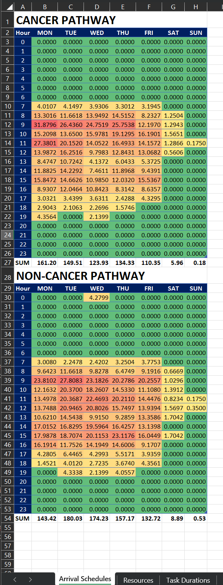
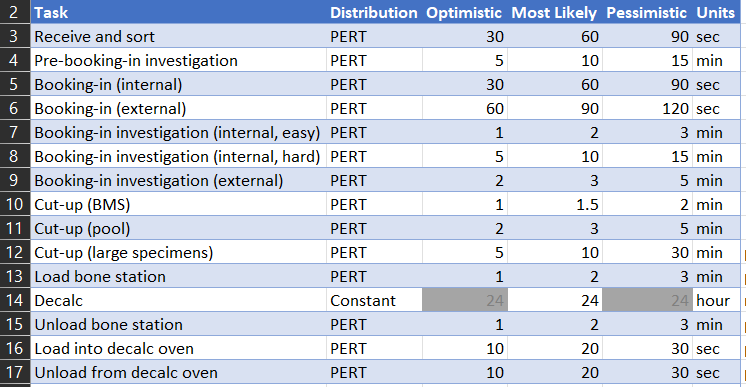

The Excel Configuration File
============================ 

Parameters are fed into the simulation program using named ranges and tables in an Excel workbook.

Arrival Schedules
-----------------

Arrival schedules are defined separately for cancer-pathway and non-cancer-pathway specimens.
The arrival schedule for each pathway is defined in a table in the "Arrival Schedules" worksheet,
with one cell for each hour of the week.  The value of each cell is the expected number of specimen
arrivals in that hour.

Resources
---------

Resources are defined in the "Resources" worksheet.  Each row contains the name of the resource,
the days of the week which the resource is available (marked as seven columns of 0/1 entries),
and the number of resource units available within each scheduled day, in 30-minute intervals.

.. image:: _static/resources.png
    :width: 800

**Note:** It is currently assumed that the resource allocation for each resource is the same for
each scheduled day.  Defining a different schedule for a specific day (e.g. Saturday) will require
changes to the program design.

Dragging a cell corner to fill the adjacent cells is a quick way of specifying the same resource
allocation level for consecutive 30-minute intervals.

Task Durations
--------------

Task durations are defined in the worksheet of the same name.  Three distributions are supported:
Constant, Triangular, and `PERT <https://en.wikipedia.org/wiki/PERT_distribution>`_.
The Triangular and PERT distributions are three-point (minimum, mode, and maximum) distributions,
with the PERT distribution having more weight towards the mode (most likely value) of the
distribution compared to the Triangular distribution.

The time units for each task duration distribution (seconds, minutes, or hours) can be selected
from a drop-down menu.  For Constant values, the minimum and maximum values (Optimistic and
Pessimistic table columns) are ignored.

*Runner times (WIP)*
--------------------

*Currently ignored by the simulation program (TODO)*

Batch Sizes
-----------

Additional Global Variables
---------------------------